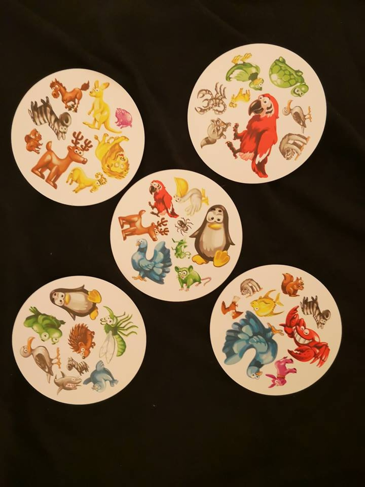
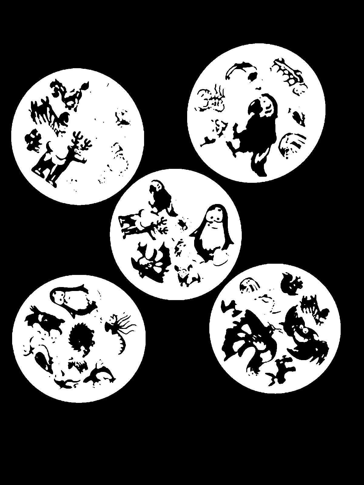
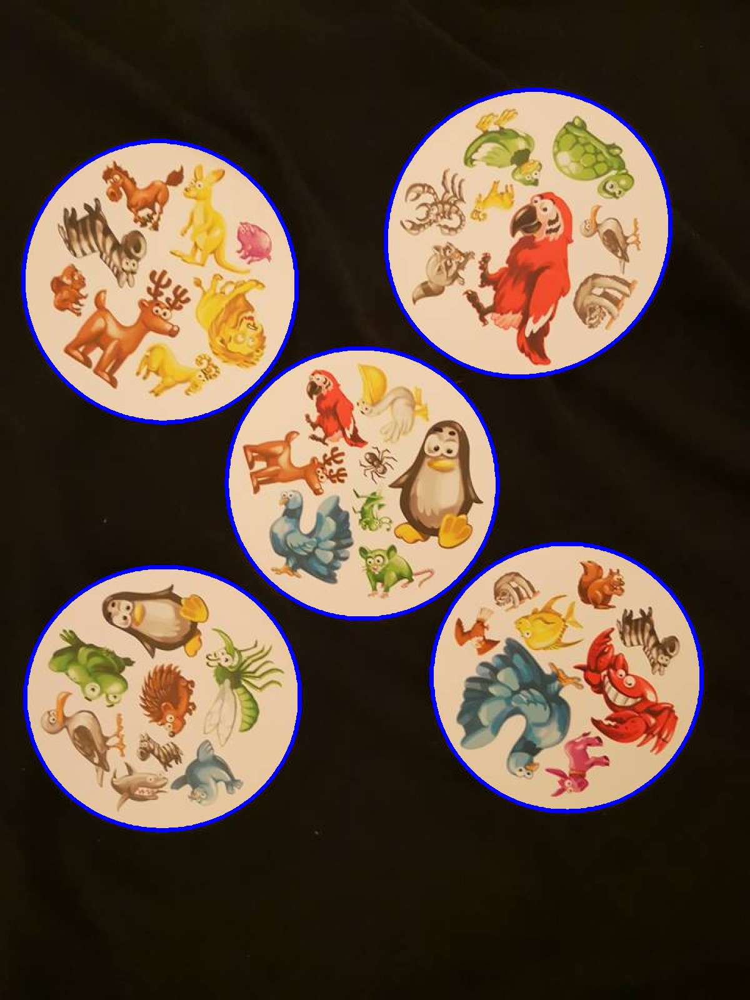
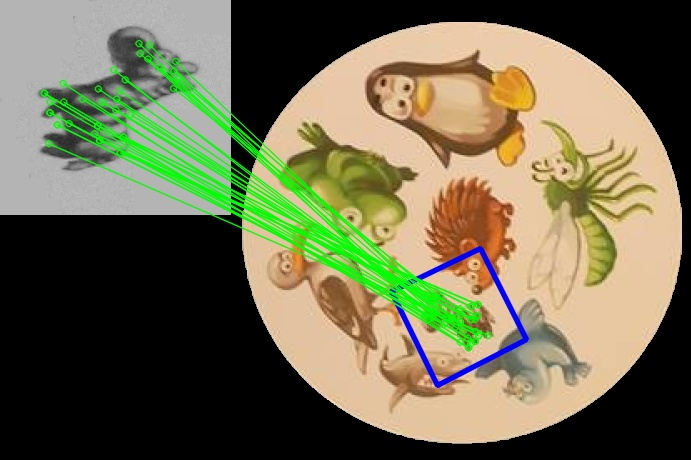
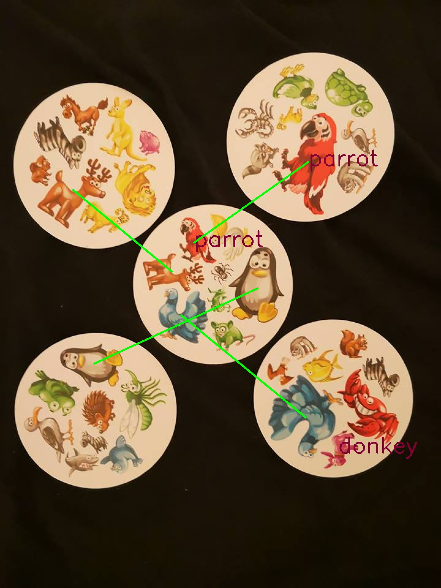

# Super Dobble!
### Your best cheat for looking for pairs in Dobble

This is the application that can find pairs between dobble cards on the image using OpenCV2 and SIFT in Python.

Result:


Steps:
Take a photo:

Count average light and set threshold:
```
avgLight>140 threshold = 140 + (avgLight-140) * 3/4
else threshold = 140
```

Find conturous on the image with threshold

Add mask for the clear image and cut circles

Load every photo with animal and compary with every card eg.

Find center circle and best pair with between center circle and every other circle. Write it on clear image
